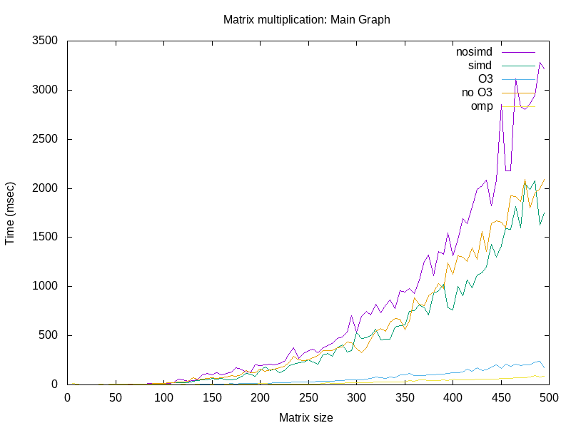

# matrix-parallelcomputing-04-alex-kroos
matrix-parallelcomputing-04-alex-kroos created by GitHub Classroom

# Distributed parallel computing:
- Explain the variations of algorithm you implemented.  
Basically, we created a file `generate_data.c` that if you compile that with the different mmult algorithms would create the data needed to create the graph and would output that data to a file. For instance, if we wanted to create the data with the SIMD algorithm we would compile and run the `generate_data` with `gcc mmult_simd.c generate_data.c` and so on for each algorithm.  
We were also able to automate this part with the `create_graph.sh` script that does every compiling  and creates the graph.
 
- Explain the variations of algorithm you implemented  
MMULT: Plain mmult that we were given 
SIMD: Was almost the same as `mmult.c` except in had one more for loop in the inner for loop so that we could achieve the `Single Instruction Multiple Data`. 
MPI: We were not able to get this part to work on time. 
OMP: Omp was just the same as the simd version of the algorithm just with the OMP oneliner and the `-fopenmp` flag to the compilation 

# Teamwork:
- Kroos Xiang: More in charge of the research part of the lab, but we definitely switched sometimes. 
- Alex Mailo: More in charge of the coding part of the lab, but we definitely switched sometimes. 
- Did you lock the master branch as explain in GitHW2 Lab 2 - Git? How did you proceed to review each other work? 
I think we did, but I am not sure.

# Full Project Cycle
- Have you used a project board? How did you used it, or if you did not use a project board how did you plan and manage your project and team work?  
We didn't really use the project board that much. We did update it as the project went on, but we did not use it as a todo-list. We just talked and assigned
work for each other, and that is how we were to get the project done.

- Is the usual cycle: write code, compile code,  run code, test code was the same when doing remote development on Wolfgand cluster. Did you need to adapt your way of working or use different tools?  
It was always kind of similar to what we've been doing before to be completely honest. It's just that this time we had a lot more tools that we've never
used before ( like GnuPlot, MPI, OMP, Wolfram, etc), and that made it a little bit more challenging than previous labs, but we pulled through.

- What kind of testing did you plan to use for this project? Did you consider measuring speed, memory consumption and validity of results for matrix multiplication. Did you consider that the code provided by the professor could have flaws?   
Our testing plan was just trial and error. We compared our answers with the ones the TA showed us, and that made it a little bit easier to see if we were on the right path or not. And no we never considered that the code given could have any flaws.

- Did you need to write code or use tools to generate random matrix of specific sizes? Did you put this in your plan?   
No, that code was already given to us in `mat.c`.

- Did you put in your plan the work needed to generate tables or graphs? Did you automate this work?    
We were able to automate the graphing part. We created a scipt `create_graph.sh` that does the entire work for us and generates the picture shown in this README.

# Testing matrix multiplication with different parallel algorithms
In this project we test the matrix multiplication algorithm using different  types of parallelizations
and APIs. 
Graph

